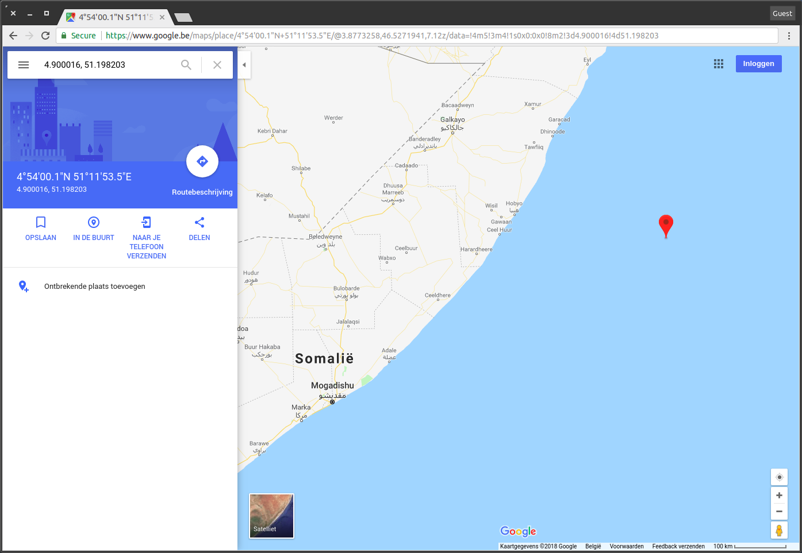
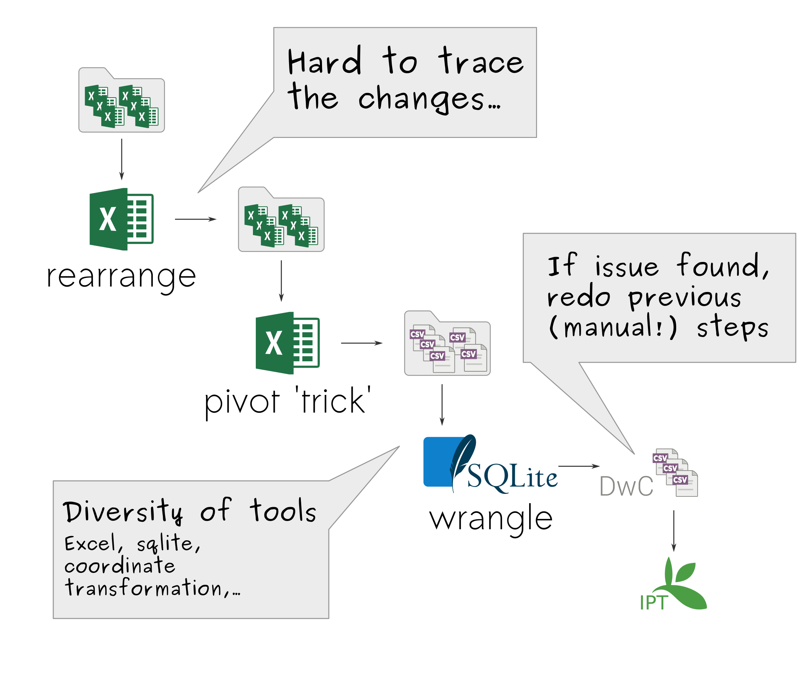
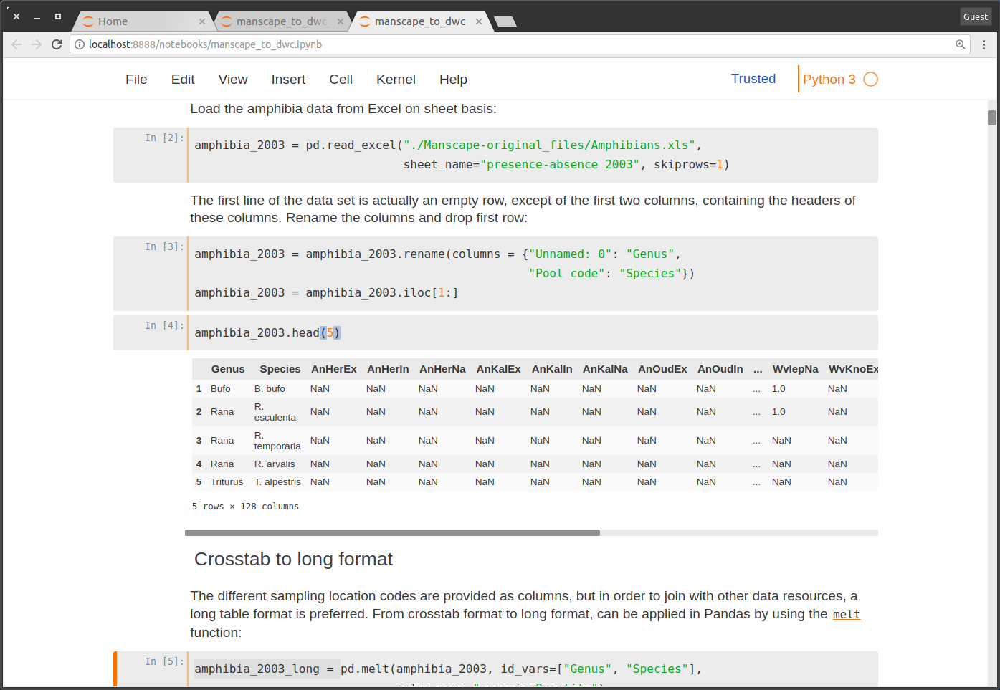
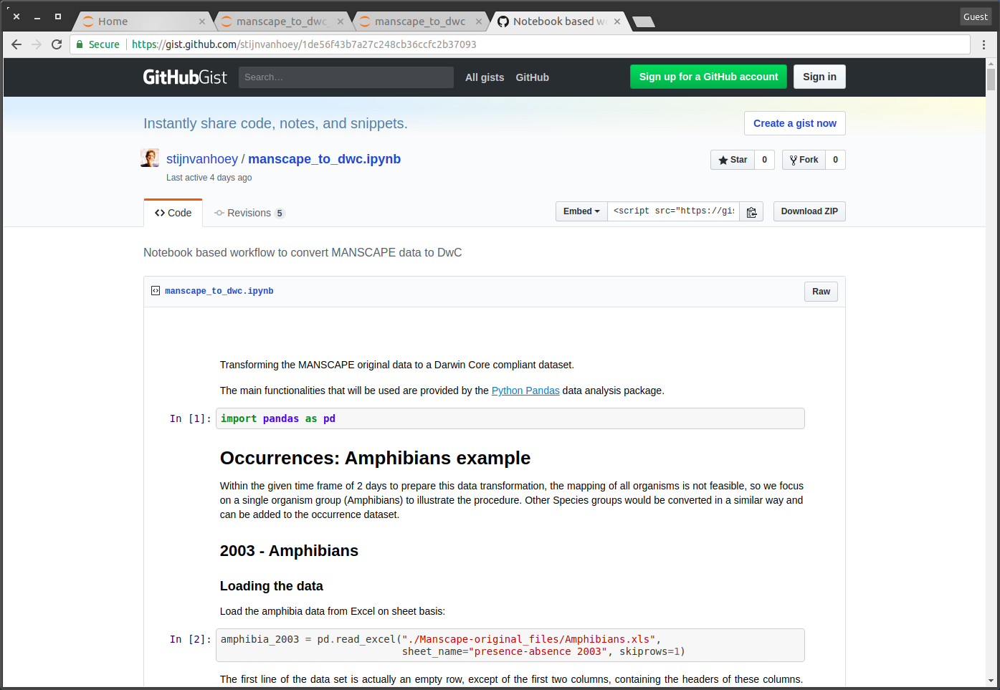
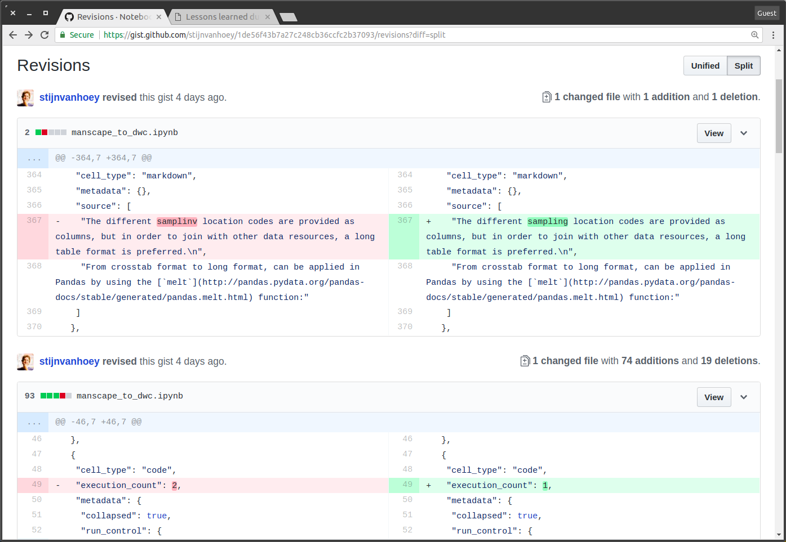
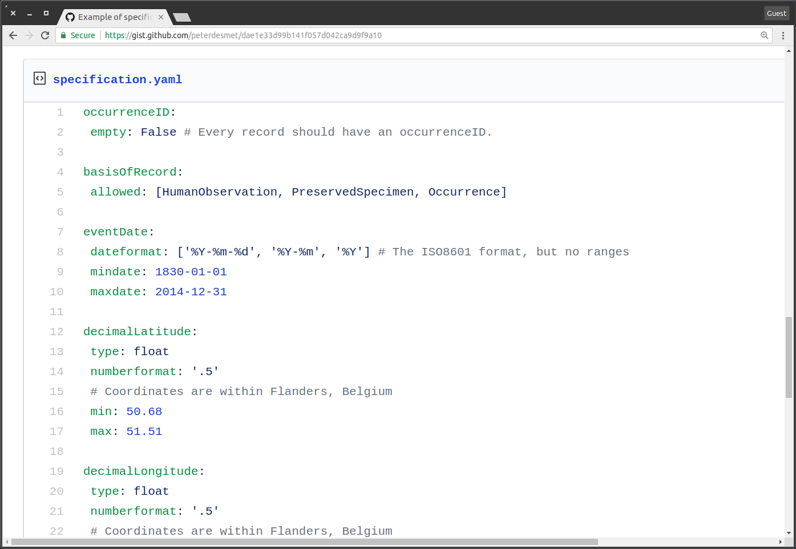

class: middle, center

# Data wrangling

### Lessons learned during SAFRED data processing

Safeguarding Biodiversity Data for the Future 
27 February 2018

Stijn Van Hoey

[<i class="fa fa-twitter"></i> @SVanHoey](https://twitter.com/svanhoey) [<i class="fa fa-github"></i> stijnvanhoey](https://github.com/inbo)

---
class: middle, center, section_background

# What's up with my data?

---
class: middle

> "... farmland ponds distributed over almost the entire **Belgian territory**."

.center[]

---
class: middle

> "... farmland ponds distributed over almost the entire **Belgian territory**."

.center[]

---
class: middle

> color annotations ...

.center[]

---
class: middle

> color annotations ...

.center[]

---
class: middle

> * measurementUnits are constraints
> * measurementValues don't follow constraints

id | measurementType | measurementValue | measurementUnit
--- | --- | --- | ---
HnPloEx_2003 | URBAN_400 | 1.193662073 | 0/1
WVIepIn_2003 | FOREST_100 | 1.193821228 | 0/1
VBHalEx_2003 | FOREST_1600 | 1.206983342 | 0/1
VBDieNa_2003 | FOREST_200 | 1.222572569 | 1/2/3/4
LiVoeIn_2003 | FOREST_400 | 1.247465892 | 1/2/3/4
WVKnoEx_2003 | URBAN_200 | 1.255517642 | 1/2/3/4

---
class: middle

> * lowercase/uppercase issues with identifiers
> * a value `782?` for conductivity
> * trailing white spaces for scientific names
> * encoding issue with units
> * remarks column wrongly included when pivoting
> * ...

---
class: middle, center

---
class: middle, center, section_background

# From `any format` to a standard

---
class: middle, center

## Initial MANSCAPE workflow

---
class: middle, center

## Initial MANSCAPE workflow

---
class: middle, center, section_background

# A reproducible workflow

---
class: middle, center

---
class: middle, center, subsection_background

#  Literate programming

---
class: middle, center

## Python

---
class: middle, center

## R

---
class: middle, center

## Executable documentation

> ... in literate programming the emphasis is reversed. Instead of writing code containing documentation, the literate programmer writes `documentation containing code`

--

.footnote[Jupyter notebook supports > 40 programming  languages, Rmarkdown rocks for R users!]

---
class: middle, center, subsection_background

#  Version control

---
class: middle, center

---
class: middle, center

---
class: middle, center

.center[]

---
class: middle, center

## A reproducible workflow

---
class: middle, center

## A reproducible workflow

.footnote[*Python `Pandas` or R `dplyr` provide most of the functionalities]

---
class: middle, center, section_background

#  We all make mistakes! 

---
class: middle, center

---
class: middle, center

## How to check  if a dataset fits the data quality `requirements`?

---
class: middle, center

## Let's `document` those

---
class: middle, center

---
class: middle, center

## Does my dataset `comply`?

---
class: middle, center

## We need human and `machine-readable` specifications

.footnote[See also the [2017 TDWG presentation](https://speakerdeck.com/peterdesmet/defining-dataset-specifications-to-communicate-data-quality-characteristics) by Peter Desmet]

---
class: middle, center

---
class: middle, center

## We call them `whip` specifications

... be it a feather or a chain whip!

.footnote[https://github.com/inbo/whip]

---
class: middle, center

## pywhip

.footnote[https://github.com/inbo/pywhip]

---
class: middle, center

## Input for pywhip

---
class: middle, center

## Output of pywhip

---
class: middle, center

## A reproducible workflow with a <i class="fa fa-check-square" aria-hidden="true"></i>

---
class: middle, center

# Thanks!

 

[<i class="fa fa-twitter"></i> @SVanHoey](https://twitter.com/svanhoey) [<i class="fa fa-github"></i> stijnvanhoey](https://github.com/inbo)

      

