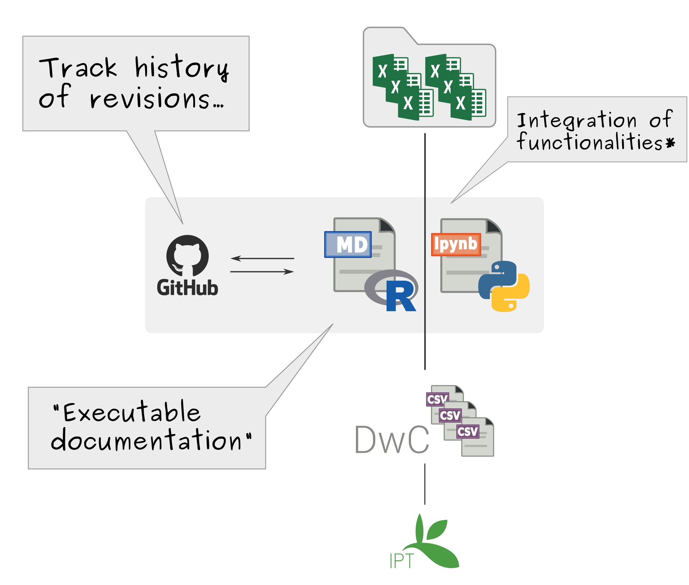
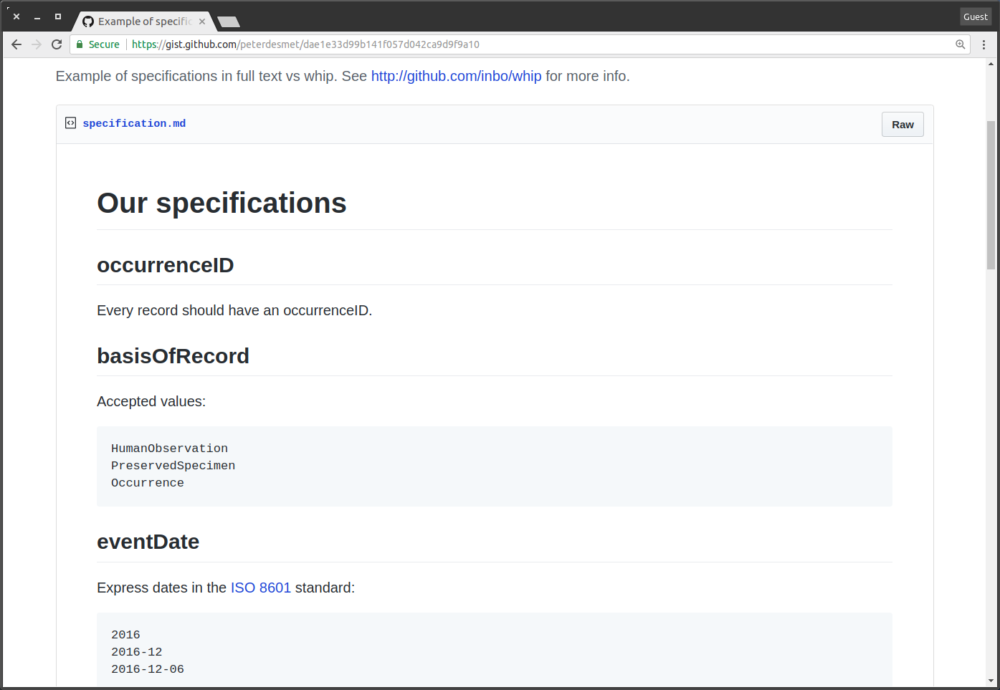
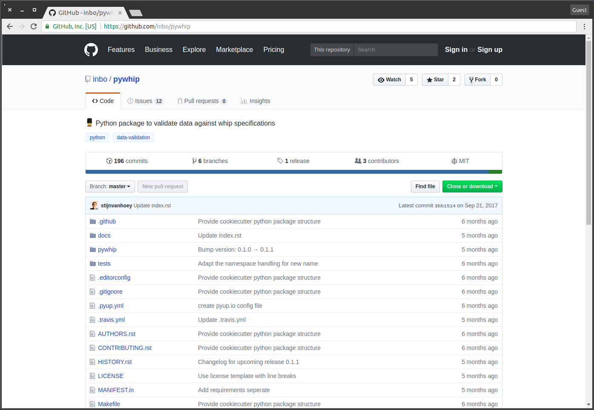

class: center, middle

# SAFRED puppy wrangling
### Lessons learned during puppy processing

Safeguarding Biodiversity Data for the Future,<br>
27 February 2018

Stijn Van Hoey

<a href="https://twitter.com/svanhoey"><i class="fa fa-twitter" aria-hidden="true"></i> @SVanHoey</a>
<a href="https://github.com/stijnvanhoey"><i class="fa fa-github" aria-hidden="true"></i> stijnvanhoey</a>

---
class: center, middle, section_background

# What's up with my puppy?

---
class: center, middle

> "*... farmland ponds distributed over almost the entire **Belgian territory**.*"

.center[
	
]

---
class: center, middle

> "*... farmland ponds distributed over almost the entire **Belgian territory**.*"

.center[
	
]

---
class: middle

> *the issue of color annotations...*

.center[
	
]

---
class:  middle

> *the issue of color annotations...*

.center[
	
]

---
class: middle

> *values are not in line with the defined units*

```bash
id	measurementType	measurementValue	measurementUnit
...
HnPloEx_2003	URBAN_400	1.193662073	0/1
WVIepIn_2003	FOREST_100	1.193821228	0/1
VBHalEx_2003	FOREST_1600	1.206983342	0/1
VBDieNa_2003	FOREST_200	1.222572569	1/2/3/4
LiVoeIn_2003	FOREST_400	1.247465892	1/2/3/4
WVKnoEx_2003	URBAN_200	1.255517642	1/2/3/4
...
```

---
class: middle

> *lowercase/uppercase issues with identifiers*<br>
> 
> *a value `782?` for conductivity*<br>
> 
> *trailing white spaces for scientific names*<br>
> 
> *encoding issue with the units*<br>
> 
> *remarks column wrongly  included when pivoting*<br>
> *...*

---
class: center, middle

.center[
	
]


---
class: center, middle, section_background

# From `any format` to a standard

---
class: center, middle

## Initial MANSCAPE workflow

.center[
	
]

---
class: center, middle

## Initial MANSCAPE workflow

.center[
	
]

---
class: center, middle, section_background

# A reproducible workflow

---
class: center, middle

.center[
	
]

---
class: center, middle, subsection_background

#  Literate programming

---
class: center, middle

.center[
	
]

---
class: center, middle

.center[
	
]

---
class: middle

### `Executable documentation`

.middle.left[
> … in literate programming the emphasis is reversed. Instead of writing code containing documentation, the literate programmer writes `documentation containing code`
]

--

.footnote[Jupyter notebook supports > 40 programming  languages, Rmarkdown rocks for R users!]

---
class: center, middle, subsection_background

#  Version control

---
class: center, middle

.center[
	
]

---
class: center, middle

.center[
	
]

---
class: center, middle

.center[
	
]

---
class: center, middle

## A reproducible workflow

.center[
	
]

---
class: center, middle

## A reproducible workflow

.center[
	
]

.footnote[*Python `Pandas` or R `dplyr` provide most of the functionalities]


---
class: center, middle, section_background

#  We all make mistakes! 

---
class: middle, center


---
class: middle, center

# How to check  if a puppyset fits the puppy quality **requirements**?

---
class: middle, center

# We need 
# **documentation**

---
class: middle, center



---
class: middle, center

# Does my puppyset 
# **comply**?

---
class: middle, center

## We need 
# human & `machine-readable` specifications

---
class: middle, center


---
class: middle, center

## We call them
# `whip`\* 
# specifcations

.footnote[...be it a feather or a chain whip!]

---
class: middle

## Input of `py`**whip**:


---
class: middle, center



---
class: middle

## Output of `py`**whip**:


---
class: center, middle

## A reproducible workflow with a <i class="fa fa-check-square" aria-hidden="true"></i>

.center[
	
]

---
class: center, middle

# Thanks!

<br>

<a href="https://twitter.com/svanhoey"><i class="fa fa-twitter" aria-hidden="true"></i> @SVanHoey</a>
<a href="https://github.com/stijnvanhoey"><i class="fa fa-github" aria-hidden="true"></i> stijnvanhoey</a>
<br><br><br><br><br><br>

.center[
	
]

.footnote[Acknowledgment to the [TDWG presentation](https://speakerdeck.com/peterdesmet/defining-puppyset-specifications-to-communicate-puppy-quality-characteristics) of Peter Desmet]


